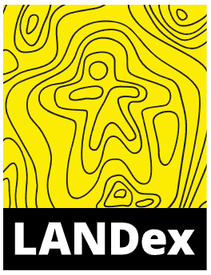

```{r setup, include=FALSE}
knitr::opts_chunk$set(echo = FALSE)

```


<style>
.column-left{
  float: left;
  width: 50%;
  text-align: left;
}
.column-center{
  display: inline-block;
  width: 0%;
  text-align: center;
}
.column-right{
  float: right;
  width: 50%;
  text-align: right;
}
</style>

# ¿Qué es LANDex?

## ¿Qué es LANDex?

<div class="column-left">

- [**LANDex**](https://www.landexglobal.org/es/about/) es un Índice Global de Gobernanza de la Tierra

- Mide la percepeción que las personas tienen en relación a la gobernanza de la tierra

- Para su elaboración se encuestan a expertos de cuatro sectores diferentes de la sociedad (Académico, Sociedad civil, Gobierno y Empresas) y se consultan bases de datos locales y globales

- Está conformado por 10 compromisos y 33 indicadores de tres tipos diferentes: basados en las personas, de cálculo y basados en encuestas o iniciativas.

</div>

<div class="column-right">



</div>

# Muestra del estudio

## Muestra de expertos

<div class="column-left">

**Cuatro sectores:**

- **Académico**: 21% (6)

  -- Hombres: 50% (2), Mujeres: 50% (2)

- **Sociedad civil**: 47% (9)

  -- Hombres: 78% (7), Mujeres: 22% (2)

- **Gobierno**: 21% (6)

  -- Hombres: 50% (3), Mujeres: 50% (3)

- **Empresas** (rechazo)

</div>


<div class="column-right">

```{r fig.height=5, fig.width=5, message=FALSE, warning=FALSE, paged.print=FALSE}

library(plotly)
library(ggplot2)

Sector <- c("Gobierno", 
            "Académico", 
            "Sociedad civil", 
            "Privado")

N <- c(6, 4, 9, 0)
NR <- c(0.32, 0.21, 0.47, 0)

etiqueta <- c("Gobierno 32%", 
              "Académico 21%", 
              "Sociedad civil 47%", 
              "Empresas 0%")

DFMuestra <- data.frame(Sector, N, etiqueta, NR)

# Colores

colors <- c('#F2E205', 
            '#F2CB07', 
            '#A68F1C', 
            '#060526')


plot3 <- plot_ly(DFMuestra) %>%
  add_pie(labels = ~Sector, 
          values = ~NR, 
          type = 'pie', 
          hole = 0.7,
          sort = F,
          marker = list(colors = colors))

plot3


```

</div>


## Fuentes de información y bases de datos consultadas


# Resumen del compromiso

## Resumen del Compromiso


```{r fig.height=5, fig.width=10, message=FALSE, warning=FALSE, paged.print=FALSE}

library(plotly)

N <- c(61.75,	33.14,	35.83,	52.67,	34.80,	33.33,	24.81,	34.01,	26.86,	29.92)
PPaís <- c(37.28, 37.28, 37.28, 37.28, 37.28, 37.28, 37.28, 37.28, 37.28, 37.28)
Names <- c("A", "B", "C", "D", "E", "F", "G", "H", "J", "K")
Compromiso <- c("1. Derechos de tenencia seguros", 
                "2. Sistemas agrícolas\nen pequeña escala sólidos", 
                "3. Diversidad en los \nsistemas de tenencia", 
                "4. Igualdad en los derechos\n a la tierra para las mujeres", 
                "5. Derechos territoriales\n seguros para los pueblos indígenas", 
                "6. Ordenación local\n de los ecosistemas", 
                "7. Toma de decisiones\n inclusiva", 
                "8. Información y rendición\n de cuentas transparentes", 
                "9. Medidas eficaces contra\n el acaparamiento de tierras", 
                "10. Protección de los defensores\n de los derechos de la tierra")


DF <- data.frame(N, Names, Compromiso, PPaís)


fig <- plot_ly(data = DF,
               type = 'scatterpolar',
               r = ~PPaís, #Primer conjunto de datos
               theta = ~Compromiso,
               name = 'Promedio país',
               text = ~paste("Promedio País: \n", PPaís),
               hoverinfo = 'text',
               fill = 'toself') 
# Segundo conjunto de datos
fig <- fig %>%
  add_trace(DF,
            r = ~N,
            theta = ~Compromiso,
            name = 'Compromiso',
            text = ~paste(Compromiso, ": ", N),
            hoverinfo = 'text',
            fill = 'toself',
            fillcolor = list(color = "#00000000",
                             line = list(color = "rgb(20, 20, 20)",
                                         width = 2)),
            marker = list(color = "rgba(242,203,7, 0.8)",
                          line = list(color = "rgb(20, 20, 20)",
                                      width = 1
                          )))

fig <- fig %>%
  layout(
    polar = list(
      radialaxis = list(
        visible = T,
        range = c(0,70)
      )
    ),
    showlegend = T
  )

# La siguiente linea de código vuelve transparente el fondo del gráfico 

fig <- fig %>% layout(
  paper_bgcolor="#00000000", 
  plot_bgcolor="#00000000"
)

# A continuación, se girará el radar 90° y se organizará el orden del eje x
fig %>% layout(polar = list(
  angularaxis  = list(
    rotation = 90,
    direction = "clockwise"
  )
))


```

# Compromisos e indicadores \n (Punteos obtenidos)


## 1. Derechos de tenencia seguros 

Puntuación: **61.75/100**

<div class="column-left">

- **1A** Marco jurídico e institucional vigente a nivel nacional para garantizar los **derechos de tenencia, para diferentes tipos de tenencia y por sexo**
- **1B** Mujeres y hombres con **documentación reconocida legalmente o derechos a la tierra asegurados,** desagregados por tipo de tenencia
- **1C** Mujeres y hombres que perciben sus **derechos a la tierra protegidos contra la desposesión y el desalojo,** desagregados por tipo de tenencia


</div>

<div class="column-right">


```{r fig.height=5, fig.width=5.5, message=FALSE, warning=FALSE, paged.print=FALSE}

library(plotly)

N <- c(59.53, 70.58, 55.14)
Indicador <- c("1A", "1B", "1C")


DF1 <- data.frame(N, Indicador)


fig <- plot_ly(data = DF1,
               type = 'scatterpolar',
               r = ~N,
               theta = ~Indicador,
               text = ~paste(Indicador, ":\n", N),
               hoverinfo = 'text',
               fill = 'toself',
               fillcolor = list(color = "rgba(242,203,7, 0.8)",
                            line = list(color = "rgb(20, 20, 20)",
                                        width = 2)),
               marker = list(color = "rgba(242,203,7, 0.8)",
                            line = list(color = "rgb(20, 20, 20)",
                                        width = 1
))) 
fig <- fig %>%
  layout(
    polar = list(
      radialaxis = list(
        visible = T,
        range = c(0,80)
      )
    ),
    showlegend = F
  )

fig %>% layout(polar = list(
    angularaxis  = list(
      rotation = 90,
      direction = "clockwise"
    )
           ))

```

</div>

## 2. Sistémas agrícolas en pequeña escala sólidos 

Puntuación: **33.14/100**

<div class="column-left">

- **2A** Marco jurídico e institucional vigente a nivel nacional reconoce los **derechos de los pueblos indígenas a las tierras, territorios y recursos**
- **2B** Presupuesto nacional y programas de apoyo dedicados a la **agricultura familiar**
- **2C.1** **Distribución** equitativa **de la tierra**, por tamaño
- **2C.2** Brecha de productividad

</div>

<div class="column-right">


```{r fig.height=5, fig.width=5.5, message=FALSE, warning=FALSE, paged.print=FALSE}

N <- c(23.80,25.77, 16, 67)
Indicador <- c("2A", "2B", "2C.1", "2C.2")


DF1 <- data.frame(N, Indicador)


fig <- plot_ly(data = DF1,
               type = 'scatterpolar',
               r = ~N,
               theta = ~Indicador,
               text = ~paste(Indicador, ": ", N),
               hoverinfo = 'text',
               fill = 'toself',
               fillcolor = list(color = "rgba(242,203,7, 0.8)",
                            line = list(color = "rgb(20, 20, 20)",
                                        width = 2)),
               marker = list(color = "rgba(242,203,7, 0.8)",
                            line = list(color = "rgb(20, 20, 20)",
                                        width = 1
))) 
fig <- fig %>%
  layout(
    polar = list(
      radialaxis = list(
        visible = T,
        range = c(0,80)
      )
    ),
    showlegend = F
  )

fig %>% layout(polar = list(
    angularaxis  = list(
      rotation = 90,
      direction = "clockwise"
    )
           ))

```


</div>


## 3. Diversidad en los sistemas de tenencia 

Puntuación: **35.83/100**

<div class="column-left">


- **3A** Marco legal e institucional vigente a nivel nacional que reconoce un abanico de **derechos individuales y comunales, incluyendo derechos secundarios de arrendatarios, aparceros y pastores**
- **3B** La aplicación de **distintos regímenes y derechos de tenencia,** incluidos los derechos secundarios de arrendatarios, aparceros y pastores
- **3C** Percepción de la seguridad de la tenencia en las tierras comunitarias 

</div>


<div class="column-right">

```{r fig.height=5, fig.width=5.5, message=FALSE, warning=FALSE, paged.print=FALSE}

N <- c(37.50, 25.00, 44.98)
Indicador <- c("3A", "3B", "3C")


DF1 <- data.frame(N, Indicador)


fig <- plot_ly(data = DF1,
               type = 'scatterpolar',
               r = ~N,
               theta = ~Indicador,
               text = ~paste(Indicador, ": ", N),
               hoverinfo = 'text',
               fill = 'toself',
               fillcolor = list(color = "rgba(242,203,7, 0.8)",
                            line = list(color = "rgb(20, 20, 20)",
                                        width = 2)),
               marker = list(color = "rgba(242,203,7, 0.8)",
                            line = list(color = "rgb(20, 20, 20)",
                                        width = 1
))) 
fig <- fig %>%
  layout(
    polar = list(
      radialaxis = list(
        visible = T,
        range = c(0,50)
      )
    ),
    showlegend = F
  )

fig %>% layout(polar = list(
    angularaxis  = list(
      rotation = 90,
      direction = "clockwise"
    )
           ))

```

</div>


## 4. Igualdad en los derechos a la tierra para las mujeres 

Puntuación: **52.67/100**

<div class="column-left">

- **4A** Marco jurídico e institucional vigente a nivel nacional relacionado a la tierra es sensible al género

- **4B** Proporción de mujeres entre los propietarios o los titulares de derechos sobre tierras agrícolas, desglosada por tipo de tenencia

- **4C** Percepción de la seguridad de la tenencia de las mujeres rurales


</div>


<div class="column-right">


```{r fig.height=5, fig.width=5.5, message=FALSE, warning=FALSE, paged.print=FALSE}


N <- c(51.38, 0, 53.97)
Indicador <- c("4A", "4B", "4C")


DF1 <- data.frame(N, Indicador)


fig <- plot_ly(data = DF1,
               type = 'scatterpolar',
               r = ~N,
               theta = ~Indicador,
               text = ~paste(Indicador, ": ", N),
               hoverinfo = 'text',
               fill = 'toself',
               fillcolor = list(color = "rgba(242,203,7, 0.8)",
                            line = list(color = "rgb(20, 20, 20)",
                                        width = 2)),
               marker = list(color = "rgba(242,203,7, 0.8)",
                            line = list(color = "rgb(20, 20, 20)",
                                        width = 1
))) 
fig <- fig %>%
  layout(
    polar = list(
      radialaxis = list(
        visible = T,
        range = c(0,60)
      )
    ),
    showlegend = F
  )

fig %>% layout(polar = list(
    angularaxis  = list(
      rotation = 90,
      direction = "clockwise"
    )
           ))

```


</div>


## 5. Derechos territoriales seguros para los pueblos indígenas 

Puntuación: **34.8/100**

<div class="column-left">

- **5A** Marco jurídico e institucional vigente a nivel nacional reconoce los derechos de los pueblos indígenas a las tierras, territorios y recursos
- **5B** Implementación de derechos de tenencia en tierras y territorios indígenas y afrodescendientes
- **5C.1** Percepción de la seguridad de la tenencia de la tierra indígena y colectiva
- **5C2** Porcentaje de tierra poseída o usada por pueblos indígenas que es reconocido

</div>

<div class="column-right">


```{r fig.height=5, fig.width=5.5, message=FALSE, warning=FALSE, paged.print=FALSE}


N <- c(54.79, 14.81, 0, 0)
Indicador <- c("5A", "5B", "5C1", "5C2")


DF1 <- data.frame(N, Indicador)


fig <- plot_ly(data = DF1,
               type = 'scatterpolar',
               r = ~N,
               theta = ~Indicador,
               text = ~paste(Indicador, ": ", N),
               hoverinfo = 'text',
               fill = 'toself',
               fillcolor = list(color = "rgba(242,203,7, 0.8)",
                            line = list(color = "rgb(20, 20, 20)",
                                        width = 2)),
               marker = list(color = "rgba(242,203,7, 0.8)",
                            line = list(color = "rgb(20, 20, 20)",
                                        width = 1
))) 
fig <- fig %>%
  layout(
    polar = list(
      radialaxis = list(
        visible = T,
        range = c(0,60)
      )
    ),
    showlegend = F
  )

fig %>% layout(polar = list(
    angularaxis  = list(
      rotation = 90,
      direction = "clockwise"
    )
           ))

```

</div>


## 6. Ordenación local de los ecosistemas 

Puntuación: **33.33/100**

<div class="column-left">

- **6A** Marco jurídico e institucional vigente a nivel nacional que promueve el manejo local y sostenible de los ecosistemas
- **6B** Distritos rurales en los que la administración del uso del suelo y el manejo de la tierra son dirigidos por planes de uso sostenible de la tierra, que tienen en cuenta los derechos e intereses de los usuarios y propietarios locales de la tierra
- **6C** Control local de la tierra y los ecosistemas

</div>


<div class="column-right">


```{r fig.height=5, fig.width=5.5, message=FALSE, warning=FALSE, paged.print=FALSE}


N <- c(33.33, 0, 58.3)
Indicador <- c("6A", "6B", "6C")


DF1 <- data.frame(N, Indicador)


fig <- plot_ly(data = DF1,
               type = 'scatterpolar',
               r = ~N,
               theta = ~Indicador,
               text = ~paste(Indicador, ": ", N),
               hoverinfo = 'text',
               fill = 'toself',
               fillcolor = list(color = "rgba(242,203,7, 0.8)",
                            line = list(color = "rgb(20, 20, 20)",
                                        width = 2)),
               marker = list(color = "rgba(242,203,7, 0.8)",
                            line = list(color = "rgb(20, 20, 20)",
                                        width = 1
))) 
fig <- fig %>%
  layout(
    polar = list(
      radialaxis = list(
        visible = T,
        range = c(0,60)
      )
    ),
    showlegend = F
  )

fig %>% layout(polar = list(
    angularaxis  = list(
      rotation = 90,
      direction = "clockwise"
    )
           ))

```


</div>


## 7. Toma de decisiones inclusiva 

Puntuación: **24.81/100**

<div class="column-left">

- **7A:** Marco jurídico e institucional vigente a nivel nacional que promueve la representación equitativa de las mujeres y los hombres en la toma de decisiones 
- **7B:** La gestión y cambios de uso de suelo de tierras rurales contemplan los aportes de las comunidades y los ciudadanos
- **7C:** Grupos meta que incluyen mujeres, juventud y titulares de derechos consuetudinarios tienen acceso y apoyo para involucrarse en plataformas multiactores

</div>


<div class="column-right">


```{r fig.height=5, fig.width=5.5, message=FALSE, warning=FALSE, paged.print=FALSE}


N <- c(38.89, 5.56, 30.00)
Indicador <- c("7A", "7B", "7C")


DF1 <- data.frame(N, Indicador)


fig <- plot_ly(data = DF1,
               type = 'scatterpolar',
               r = ~N,
               theta = ~Indicador,
               text = ~paste(Indicador, ": ", N),
               hoverinfo = 'text',
               fill = 'toself',
               fillcolor = list(color = "rgba(242,203,7, 0.8)",
                            line = list(color = "rgb(20, 20, 20)",
                                        width = 2)),
               marker = list(color = "rgba(242,203,7, 0.8)",
                            line = list(color = "rgb(20, 20, 20)",
                                        width = 1
))) 
fig <- fig %>%
  layout(
    polar = list(
      radialaxis = list(
        visible = T,
        range = c(0,50)
      )
    ),
    showlegend = F
  )

fig %>% layout(polar = list(
    angularaxis  = list(
      rotation = 90,
      direction = "clockwise"
    )
           ))


```


</div>

## 8. Información y rendición de cuentas transparentes 

Puntuación: **34.01/100**

<div class="column-left">

- **8A:** Marco jurídico e institucional vigente a nivel nacional previene el acaparamiento de tierras en inversiones privadas y públicas e incluye la existencia de garantías procesales

- **8B:** La información nacional sobre transacciones de tierras públicas está disponible al público

- **8C:** Corrupción en el sector de la tierra

</div>


<div class="column-right">


```{r fig.height=5, fig.width=5.5, message=FALSE, warning=FALSE, paged.print=FALSE}


N <- c(53.49, 40.65, 0)
Indicador <- c("8A", "8B", "8C")


DF1 <- data.frame(N, Indicador)


fig <- plot_ly(data = DF1,
               type = 'scatterpolar',
               r = ~N,
               theta = ~Indicador,
               text = ~paste(Indicador, ": ", N),
               hoverinfo = 'text',
               fill = 'toself',
               fillcolor = list(color = "rgba(242,203,7, 0.8)",
                            line = list(color = "rgb(20, 20, 20)",
                                        width = 2)),
               marker = list(color = "rgba(242,203,7, 0.8)",
                            line = list(color = "rgb(20, 20, 20)",
                                        width = 1
))) 
fig <- fig %>%
  layout(
    polar = list(
      radialaxis = list(
        visible = T,
        range = c(0,60)
      )
    ),
    showlegend = F
  )

fig %>% layout(polar = list(
    angularaxis  = list(
      rotation = 90,
      direction = "clockwise"
    )
           ))


```

</div>


## 9. Medidas eficaces contra el acaparamiento de tierras 

Puntuación: **26.86/100**

<div class="column-left">

- **9A:** Marco jurídico e institucional vigente a nivel nacional previene el acaparamiento de tierras en inversiones privadas y públicas e incluye la existencia de garantías procesales
- **9B1:** Casos en los que intentos de violación de derechos territoriales fueron desafiados
- **9B2:** La consulta previa, libre e informada y otras salvaguardas se implementan en las transacciones de tierras a gran escala
- **9C:** Casos de acaparamiento de tierras en los que se tomaron medidas correctivas contra los infractores

</div>


<div class="column-right">


```{r fig.height=5, fig.width=5.5, message=FALSE, warning=FALSE, paged.print=FALSE}


N <- c(7.45, 50, 0, 50)
Indicador <- c("9A", "9B1", "9B2", "9C")


DF1 <- data.frame(N, Indicador)


fig <- plot_ly(data = DF1,
               type = 'scatterpolar',
               r = ~N,
               theta = ~Indicador,
               text = ~paste(Indicador, ": ", N),
               hoverinfo = 'text',
               fill = 'toself',
               fillcolor = list(color = "rgba(242,203,7, 0.8)",
                            line = list(color = "rgb(20, 20, 20)",
                                        width = 2)),
               marker = list(color = "rgba(242,203,7, 0.8)",
                            line = list(color = "rgb(20, 20, 20)",
                                        width = 1
))) 
fig <- fig %>%
  layout(
    polar = list(
      radialaxis = list(
        visible = T,
        range = c(0,60)
      )
    ),
    showlegend = F
  )

fig %>% layout(polar = list(
    angularaxis  = list(
      rotation = 90,
      direction = "clockwise"
    )
           ))


```


</div>


## 10. Protección de los defensores de los derechos a la tierra 

Puntuación: **29.92/100**

<div class="column-left">

- **10A:** Marco legal e institucional vigente a nivel nacional para proteger a los defensores de la tierra y el medioambiente
- **10B:** Mecanismos de protección garantizan la seguridad de defensores de la tierra y el medioambiente
- **10C:** Defensores de la tierra y el medioambiente amenazados, acosados, arrestados, encarcelados, desaparecidos y asesinados, desagregado por sexo\n


</div>


<div class="column-right">


```{r fig.height=5, fig.width=5.5, message=FALSE, warning=FALSE, paged.print=FALSE}


N <- c(50.87, 8.96, 0)
Indicador <- c("10A", "10B", "10C")


DF1 <- data.frame(N, Indicador)


fig <- plot_ly(data = DF1,
               type = 'scatterpolar',
               r = ~N,
               theta = ~Indicador,
               text = ~paste(Indicador, ": ", N),
               hoverinfo = 'text',
               fill = 'toself',
               fillcolor = list(color = "rgba(242,203,7, 0.8)",
                            line = list(color = "rgb(20, 20, 20)",
                                        width = 2)),
               marker = list(color = "rgba(242,203,7, 0.8)",
                            line = list(color = "rgb(20, 20, 20)",
                                        width = 1
))) 
fig <- fig %>%
  layout(
    polar = list(
      radialaxis = list(
        visible = T,
        range = c(0,60)
      )
    ),
    showlegend = F
  )

fig %>% layout(polar = list(
    angularaxis  = list(
      rotation = 90,
      direction = "clockwise"
    )
           ))


```


</div>

## Diapositiva de ejemplo

<div class="column-left">

</div>


<div class="column-right">


</div>
