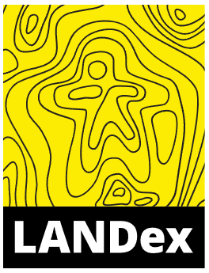

```{r setup, include=FALSE}
knitr::opts_chunk$set(echo = FALSE)
```

<meta name="viewport" content="width=device-width, initial-scale=1.0">


<style>
.column-left{
  float: left;
  width: 50%;
  text-align: left;
}
.column-center{
  display: inline-block;
  width: 0%;
  text-align: center;
}
.column-right{
  float: right;
  width: 50%;
  text-align: right;
}
</style>

# ¿Qué es LANDex?

## ¿Qué es LANDex?

<div class="column-left">

- [**LANDex**](https://www.landexglobal.org/es/about/) es un Índice Global de Gobernanza de la Tierra

- Mide la percepeción que las personas tienen en relación a la gobernanza de la tierra en una escala de 0 a 100 puntos

- Para su elaboración se encuestan a expertos de cuatro sectores diferentes de la sociedad (Académico, Sociedad civil, Gobierno y Empresas) y se consultan bases de datos locales y globales

- Está conformado por 10 compromisos y 33 indicadores de tres tipos diferentes: basados en las personas, de cálculo y basados en encuestas o iniciativas.

</div>

<div class="column-right">



</div>

# Muestra del estudio

## Muestra de expertos

<div class="column-left">

**Cuatro sectores:**

- **Académico**: 21% (4)

  -- Hombres: 50% (2), Mujeres: 50% (2)

- **Sociedad civil**: 47% (9)

  -- Hombres: 78% (7), Mujeres: 22% (2)

- **Gobierno**: 32% (6)

  -- Hombres: 50% (3), Mujeres: 50% (3)

- **Privado** (rechazo)

</div>


<div class="column-right">

```{r fig.height=5, fig.width=5, message=FALSE, warning=FALSE, paged.print=FALSE}

library(plotly)
library(ggplot2)

Sector <- c("Gobierno", 
            "Académico", 
            "Sociedad civil", 
            "Privado")

N <- c(6, 4, 9, 0)
NR <- c(0.32, 0.21, 0.47, 0)

etiqueta <- c("Gobierno 32%", 
              "Académico 21%", 
              "Sociedad civil 47%", 
              "Empresas 0%")

DFMuestra <- data.frame(Sector, N, etiqueta, NR)

# Colores

colors <- c('#F2E205', 
            '#F2CB07', 
            '#A68F1C', 
            '#060526')


plot3 <- plot_ly(DFMuestra) %>%
  add_pie(labels = ~Sector, 
          values = ~N, 
          type = 'pie', 
          hole = 0.7,
          sort = F,
          marker = list(colors = colors))

plot3


```

</div>


## Fuentes de información y bases de datos consultadas

|  Indicador | Fuente |
|---|---|
| 1B, 1C, 3C, 4C, 6C  | Prindex  |
| 2B  | Miriam Suyuc. Informe de agricultura familiar campesina e indígena. Informe de avances. Guatemala, 2021 (cortesía de Congcoop)   |
| 2C.1  | International Land Coalition  |
| 2C.2  | Banco Mundial  |
| 9B1 y 9C  | LandMatrix  |


# Resumen del compromiso

## LANDex a escala global

```{r fig.height=4.5, fig.width=10, message=FALSE, warning=FALSE, paged.print=FALSE}

library(plotly)


Punteo <- c(45, 57, 50, 57, 54, 46, 36)

Pais <- c("Sud África", "Mongolia", "Colombia", 
          "Senegal", "Nepal", "Peru", 
          "Guatemala")


DF2 <- data.frame(Punteo, Pais)

# Se ordenan las variables de forma descendente:

DF2$Pais <- factor(DF2$Pais, levels = unique(DF2$Pais)[order(DF2$Punteo, decreasing = FALSE)])


fig <- plot_ly(DF2, x = ~Punteo, 
               y = ~Pais, 
               type = 'bar',
               orientation = "h",
               hoverinfo = 'text', # esta función corrije las etiquetas interactivas
               text = ~paste(Pais, ":", Punteo, "promedio país"),
               marker = list(color = c('#fcf264', '#fcf264',
                                       '#fcf264', '#fcf264',
                                       '#fcf264', '#fcf264',
                                       '#F2CB07')
                             ))

fig <- fig %>% layout(title = "",
                      xaxis = list(title = "LANDex: promedio país (escala de 1 a 100)"),
                      yaxis = list(title = ""))

fig %>% add_annotations(text = ~Punteo, showarrow = F, xshift = -25)

```


## Resumen del Compromiso: puntuaciones obtenidas


```{r fig.height=5, fig.width=10, message=FALSE, warning=FALSE, paged.print=FALSE}

library(plotly)

N <- c(61.61,	33.14,	35.83,	52.79,	34.80,	33.33,	24.81,	47.02,	26.86,	15.59)
PPaís <- c(36.17, 36.17, 36.17, 36.17, 36.17, 36.17, 36.17, 36.17, 36.17, 36.17)
Names <- c("A", "B", "C", "D", "E", "F", "G", "H", "J", "K")
Compromiso <- c("1. Derechos de tenencia seguros", 
                "2. Sistemas agrícolas\nen pequeña escala sólidos", 
                "3. Diversidad en los \nsistemas de tenencia", 
                "4. Igualdad en los derechos\n a la tierra para las mujeres", 
                "5. Derechos territoriales\n seguros para los pueblos indígenas", 
                "6. Ordenación local\n de los ecosistemas", 
                "7. Toma de decisiones\n inclusiva", 
                "8. Información y rendición\n de cuentas transparentes", 
                "9. Medidas eficaces contra\n el acaparamiento de tierras", 
                "10. Protección de los defensores\n de los derechos de la tierra")


DF <- data.frame(N, Names, Compromiso, PPaís)


fig <- plot_ly(data = DF,
               type = 'scatterpolar',
               r = ~PPaís, #Primer conjunto de datos
               theta = ~Compromiso,
               name = 'Promedio país',
               text = ~paste("Promedio País: \n", PPaís),
               hoverinfo = 'text',
               fill = 'toself') 
# Segundo conjunto de datos
fig <- fig %>%
  add_trace(DF,
            r = ~N,
            theta = ~Compromiso,
            name = 'Compromiso',
            text = ~paste(Compromiso, ": ", N),
            hoverinfo = 'text',
            fill = 'toself',
            fillcolor = list(color = "#00000000",
                             line = list(color = "rgb(20, 20, 20)",
                                         width = 2)),
            marker = list(color = "rgba(242,203,7, 0.8)",
                          line = list(color = "rgb(20, 20, 20)",
                                      width = 1
                          )))

fig <- fig %>%
  layout(
    polar = list(
      radialaxis = list(
        visible = T,
        range = c(0,70)
      )
    ),
    showlegend = T
  )

# La siguiente linea de código vuelve transparente el fondo del gráfico 

fig <- fig %>% layout(
  paper_bgcolor="#00000000", 
  plot_bgcolor="#00000000"
)

# A continuación, se girará el radar 90° y se organizará el orden del eje x
fig %>% layout(polar = list(
  angularaxis  = list(
    rotation = 90,
    direction = "clockwise"
  )
))


```


# Compromisos e indicadores \n (Punteos obtenidos)


## 1. Derechos de tenencia seguros 

Puntuación: **61.61/100**

<div class="column-left">

- **1A** Marco jurídico para garantizar los derechos de tenencia
- **1B** Documentación rural de los derechos de seguridad de la tenencia
- **1C** Percepción rural de la seguridad de la tenencia

</div>

<div class="column-right">


```{r fig.height=5, fig.width=5.5, message=FALSE, warning=FALSE, paged.print=FALSE}

library(plotly)

N <- c(59.12, 70.58, 55.14)
Indicador <- c("1A", "1B", "1C")


DF1 <- data.frame(N, Indicador)


fig <- plot_ly(data = DF1,
               type = 'scatterpolar',
               r = ~N,
               theta = ~Indicador,
               text = ~paste(Indicador, ":\n", N),
               hoverinfo = 'text',
               fill = 'toself',
               fillcolor = list(color = "rgba(242,203,7, 0.8)",
                            line = list(color = "rgb(20, 20, 20)",
                                        width = 2)),
               marker = list(color = "rgba(242,203,7, 0.8)",
                            line = list(color = "rgb(20, 20, 20)",
                                        width = 1
))) 
fig <- fig %>%
  layout(
    polar = list(
      radialaxis = list(
        visible = T,
        range = c(0,80)
      )
    ),
    showlegend = F
  )

fig %>% layout(polar = list(
    angularaxis  = list(
      rotation = 90,
      direction = "clockwise"
    )
           ))

```

</div>

## 2. Sistemas agrícolas en pequeña escala sólidos 

Puntuación: **33.14/100**

<div class="column-left">

- **2A** Marco jurídico para apoyar a los agricultores familiares
- **2B** Presupuesto y programas de apoyo a los agricultores familiares
- **2C.1** Distribución equitativa de la tierra
- **2C.2** Brecha de productividad

</div>

<div class="column-right">


```{r fig.height=5, fig.width=5.5, message=FALSE, warning=FALSE, paged.print=FALSE}

N <- c(23.80,25.77, 16, 67)
Indicador <- c("2A", "2B", "2C.1", "2C.2")


DF1 <- data.frame(N, Indicador)


fig <- plot_ly(data = DF1,
               type = 'scatterpolar',
               r = ~N,
               theta = ~Indicador,
               text = ~paste(Indicador, ": ", N),
               hoverinfo = 'text',
               fill = 'toself',
               fillcolor = list(color = "rgba(242,203,7, 0.8)",
                            line = list(color = "rgb(20, 20, 20)",
                                        width = 2)),
               marker = list(color = "rgba(242,203,7, 0.8)",
                            line = list(color = "rgb(20, 20, 20)",
                                        width = 1
))) 
fig <- fig %>%
  layout(
    polar = list(
      radialaxis = list(
        visible = T,
        range = c(0,80)
      )
    ),
    showlegend = F
  )

fig %>% layout(polar = list(
    angularaxis  = list(
      rotation = 90,
      direction = "clockwise"
    )
           ))

```


</div>


## 3. Diversidad en los sistemas de tenencia 

Puntuación: **35.83/100**

<div class="column-left">


- **3A** Marco jurídico para la diversidad de derechos de tenencia
- **3B** Aplicación de diversos derechos de tenencia
- **3C** Percepción de la seguridad de la tenencia en las tierras comunitarias

</div>


<div class="column-right">

```{r fig.height=5, fig.width=5.5, message=FALSE, warning=FALSE, paged.print=FALSE}

N <- c(37.50, 25.00, 44.98)
Indicador <- c("3A", "3B", "3C")


DF1 <- data.frame(N, Indicador)


fig <- plot_ly(data = DF1,
               type = 'scatterpolar',
               r = ~N,
               theta = ~Indicador,
               text = ~paste(Indicador, ": ", N),
               hoverinfo = 'text',
               fill = 'toself',
               fillcolor = list(color = "rgba(242,203,7, 0.8)",
                            line = list(color = "rgb(20, 20, 20)",
                                        width = 2)),
               marker = list(color = "rgba(242,203,7, 0.8)",
                            line = list(color = "rgb(20, 20, 20)",
                                        width = 1
))) 
fig <- fig %>%
  layout(
    polar = list(
      radialaxis = list(
        visible = T,
        range = c(0,50)
      )
    ),
    showlegend = F
  )

fig %>% layout(polar = list(
    angularaxis  = list(
      rotation = 90,
      direction = "clockwise"
    )
           ))

```

</div>


## 4. Igualdad en los derechos a la tierra para las mujeres 

Puntuación: **52.79/100**

<div class="column-left">

- **4A** Sensibilidad del marco jurídico a las cuestiones de género

- **4B** Proporción de mujeres entre los propietarios de tierras agrícolas y los titulares de derechos

- **4C** Percepción de la seguridad de la tenencia de las mujeres rurales

</div>


<div class="column-right">


```{r fig.height=5, fig.width=5.5, message=FALSE, warning=FALSE, paged.print=FALSE}


N <- c(51.60, 0, 53.97)
Indicador <- c("4A", "4B", "4C")


DF1 <- data.frame(N, Indicador)


fig <- plot_ly(data = DF1,
               type = 'scatterpolar',
               r = ~N,
               theta = ~Indicador,
               text = ~paste(Indicador, ": ", N),
               hoverinfo = 'text',
               fill = 'toself',
               fillcolor = list(color = "rgba(242,203,7, 0.8)",
                            line = list(color = "rgb(20, 20, 20)",
                                        width = 2)),
               marker = list(color = "rgba(242,203,7, 0.8)",
                            line = list(color = "rgb(20, 20, 20)",
                                        width = 1
))) 
fig <- fig %>%
  layout(
    polar = list(
      radialaxis = list(
        visible = T,
        range = c(0,60)
      )
    ),
    showlegend = F
  )

fig %>% layout(polar = list(
    angularaxis  = list(
      rotation = 90,
      direction = "clockwise"
    )
           ))

```


</div>


## 5. Derechos territoriales seguros para los pueblos indígenas 

Puntuación: **34.8/100**

<div class="column-left">

- **5A** Marco jurídico para el reconocimiento de los derechos indígenas a la tierra, el territorio y los recursos
- **5B** Aplicación de los derechos territoriales indígenas
- **5C.1** Percepción de la seguridad de la tenencia de la tierra indígena y colectiva
- **5C2** Porcentaje de la tierra en manos de los pueblos indígenas que se reconoce

</div>

<div class="column-right">


```{r fig.height=5, fig.width=5.5, message=FALSE, warning=FALSE, paged.print=FALSE}


N <- c(54.79, 14.81, 0, 0)
Indicador <- c("5A", "5B", "5C1", "5C2")


DF1 <- data.frame(N, Indicador)


fig <- plot_ly(data = DF1,
               type = 'scatterpolar',
               r = ~N,
               theta = ~Indicador,
               text = ~paste(Indicador, ": ", N),
               hoverinfo = 'text',
               fill = 'toself',
               fillcolor = list(color = "rgba(242,203,7, 0.8)",
                            line = list(color = "rgb(20, 20, 20)",
                                        width = 2)),
               marker = list(color = "rgba(242,203,7, 0.8)",
                            line = list(color = "rgb(20, 20, 20)",
                                        width = 1
))) 
fig <- fig %>%
  layout(
    polar = list(
      radialaxis = list(
        visible = T,
        range = c(0,60)
      )
    ),
    showlegend = F
  )

fig %>% layout(polar = list(
    angularaxis  = list(
      rotation = 90,
      direction = "clockwise"
    )
           ))

```

</div>


## 6. Ordenación local de los ecosistemas 

Puntuación: **33.33/100**

<div class="column-left">

- **6A** El marco jurídico promueve la gestión local y sostenible de los ecosistemas
- **6B** Distritos rurales con planes inclusivos de uso y cambio de la tierra
- **6C** Control local de la tierra y los ecosistemas

</div>


<div class="column-right">


```{r fig.height=5, fig.width=5.5, message=FALSE, warning=FALSE, paged.print=FALSE}


N <- c(33.33, 0, 58.3)
Indicador <- c("6A", "6B", "6C")


DF1 <- data.frame(N, Indicador)


fig <- plot_ly(data = DF1,
               type = 'scatterpolar',
               r = ~N,
               theta = ~Indicador,
               text = ~paste(Indicador, ": ", N),
               hoverinfo = 'text',
               fill = 'toself',
               fillcolor = list(color = "rgba(242,203,7, 0.8)",
                            line = list(color = "rgb(20, 20, 20)",
                                        width = 2)),
               marker = list(color = "rgba(242,203,7, 0.8)",
                            line = list(color = "rgb(20, 20, 20)",
                                        width = 1
))) 
fig <- fig %>%
  layout(
    polar = list(
      radialaxis = list(
        visible = T,
        range = c(0,60)
      )
    ),
    showlegend = F
  )

fig %>% layout(polar = list(
    angularaxis  = list(
      rotation = 90,
      direction = "clockwise"
    )
           ))

```


</div>


## 7. Toma de decisiones inclusiva 

Puntuación: **24.81/100**

<div class="column-left">

- **7A:** El marco legal promueve la representación en la toma de decisiones
- **7B:** Gestión del uso del suelo rural basada en las aportaciones
- **7C:** Los grupos meta tienen acceso a plataformas de multi actores y participan en ellas

</div>


<div class="column-right">


```{r fig.height=5, fig.width=5.5, message=FALSE, warning=FALSE, paged.print=FALSE}


N <- c(38.89, 5.56, 30.00)
Indicador <- c("7A", "7B", "7C")


DF1 <- data.frame(N, Indicador)


fig <- plot_ly(data = DF1,
               type = 'scatterpolar',
               r = ~N,
               theta = ~Indicador,
               text = ~paste(Indicador, ": ", N),
               hoverinfo = 'text',
               fill = 'toself',
               fillcolor = list(color = "rgba(242,203,7, 0.8)",
                            line = list(color = "rgb(20, 20, 20)",
                                        width = 2)),
               marker = list(color = "rgba(242,203,7, 0.8)",
                            line = list(color = "rgb(20, 20, 20)",
                                        width = 1
))) 
fig <- fig %>%
  layout(
    polar = list(
      radialaxis = list(
        visible = T,
        range = c(0,50)
      )
    ),
    showlegend = F
  )

fig %>% layout(polar = list(
    angularaxis  = list(
      rotation = 90,
      direction = "clockwise"
    )
           ))


```


</div>

## 8. Información y rendición de cuentas transparentes 

Puntuación: **47.02/100**

<div class="column-left">

- **8A:** El marco jurídico exige datos fiables y accesibles sobre la tierra

- **8B:** La información sobre los acuerdos públicos sobre la tierra está a disposición del público

- **8C:** Corrupción en el sector de la tierra

</div>


<div class="column-right">


```{r fig.height=5, fig.width=5.5, message=FALSE, warning=FALSE, paged.print=FALSE}


N <- c(53.49, 40.65, 0)
Indicador <- c("8A", "8B", "8C")


DF1 <- data.frame(N, Indicador)


fig <- plot_ly(data = DF1,
               type = 'scatterpolar',
               r = ~N,
               theta = ~Indicador,
               text = ~paste(Indicador, ": ", N),
               hoverinfo = 'text',
               fill = 'toself',
               fillcolor = list(color = "rgba(242,203,7, 0.8)",
                            line = list(color = "rgb(20, 20, 20)",
                                        width = 2)),
               marker = list(color = "rgba(242,203,7, 0.8)",
                            line = list(color = "rgb(20, 20, 20)",
                                        width = 1
))) 
fig <- fig %>%
  layout(
    polar = list(
      radialaxis = list(
        visible = T,
        range = c(0,60)
      )
    ),
    showlegend = F
  )

fig %>% layout(polar = list(
    angularaxis  = list(
      rotation = 90,
      direction = "clockwise"
    )
           ))


```

</div>


## 9. Medidas eficaces contra el acaparamiento de tierras 

Puntuación: **26.86/100**

<div class="column-left">

- **9A:** El marco jurídico impide el acaparamiento de tierras e incluye salvaguardias
- **9B1:** Casos en los que se impugnaron las violaciones de los derechos sobre la tierra
- **9B2:** La consulta previa, libre e informada y otras salvaguardas se implementan en las transacciones de tierras a gran escala
- **9C:** Casos de acaparamiento de tierras en los que se tomaron medidas correctivas contra los infractores

</div>


<div class="column-right">


```{r fig.height=5, fig.width=5.5, message=FALSE, warning=FALSE, paged.print=FALSE}


N <- c(7.45, 50, 0, 50)
Indicador <- c("9A", "9B1", "9B2", "9C")


DF1 <- data.frame(N, Indicador)


fig <- plot_ly(data = DF1,
               type = 'scatterpolar',
               r = ~N,
               theta = ~Indicador,
               text = ~paste(Indicador, ": ", N),
               hoverinfo = 'text',
               fill = 'toself',
               fillcolor = list(color = "rgba(242,203,7, 0.8)",
                            line = list(color = "rgb(20, 20, 20)",
                                        width = 2)),
               marker = list(color = "rgba(242,203,7, 0.8)",
                            line = list(color = "rgb(20, 20, 20)",
                                        width = 1
))) 
fig <- fig %>%
  layout(
    polar = list(
      radialaxis = list(
        visible = T,
        range = c(0,60)
      )
    ),
    showlegend = F
  )

fig %>% layout(polar = list(
    angularaxis  = list(
      rotation = 90,
      direction = "clockwise"
    )
           ))


```


</div>


## 10. Protección de los defensores de los derechos a la tierra 

Puntuación: **15.59/100**

<div class="column-left">

- **10A:** Marco legal e institucional vigente a nivel nacional para proteger a los defensores de la tierra y el medioambiente
- **10B:** Mecanismos de protección garantizan la seguridad de defensores de la tierra y el medioambiente
- **10C:** Defensores de la tierra y el medioambiente amenazados, acosados, arrestados, encarcelados, desaparecidos y asesinados, desagregado por sexo\n


</div>


<div class="column-right">


```{r fig.height=5, fig.width=5.5, message=FALSE, warning=FALSE, paged.print=FALSE}


N <- c(22.22, 8.96, 0)
Indicador <- c("10A", "10B", "10C")


DF1 <- data.frame(N, Indicador)


fig <- plot_ly(data = DF1,
               type = 'scatterpolar',
               r = ~N,
               theta = ~Indicador,
               text = ~paste(Indicador, ": ", N),
               hoverinfo = 'text',
               fill = 'toself',
               fillcolor = list(color = "rgba(242,203,7, 0.8)",
                            line = list(color = "rgb(20, 20, 20)",
                                        width = 2)),
               marker = list(color = "rgba(242,203,7, 0.8)",
                            line = list(color = "rgb(20, 20, 20)",
                                        width = 1
))) 
fig <- fig %>%
  layout(
    polar = list(
      radialaxis = list(
        visible = T,
        range = c(0,30)
      )
    ),
    showlegend = F
  )

fig %>% layout(polar = list(
    angularaxis  = list(
      rotation = 90,
      direction = "clockwise"
    )
           ))


```

</div>


# Conclusiones y recomendaciones

## Conclusiones y recomendaciones

- En Guatemala existe un marco jurídico y políticas públicas dedicadas a la tierra incapaz de atender las necesidades actuales del área rural. Por lo que es necesario promover leyes que garanticen la igualdad de derechos para el acceso y protección a la tierra, particularmente para las mujeres, los pueblos indígenas, agricultores familiares y campesinos. También es necesario modernizar el marco jurídico para reconcer y proteger diversos sistemas de tenencia de la tierra y tomar medidas para impedir que el acaparamiento y concentración de tierras en pocas manos continúe. Los resultados del índice también demuestran que es urgente tomar medidas para garantizar los derechos humanos de los defensores de la tierra y el medio ambiente.

## Conclusiones y recomendaciones

- Es necesario actualizar y garantizar el financiamiento de políticas públicas para planificar e implementar programas y proyectos enfocados en:
    * Igualdad de derechos a la tierra para las mujeres.
    * Financiamiento y formación técnica para el desarrollo de sistemas agrícolas en pequeña escala, particularmente la agricultura familiar.
    * El reconocimiento y protección de diversos sistemas de tenencia y territorios indígenas.
    * Ordenanción local de ecosistemas, especialmente en relación a la formulación y cumplimiento de planes de utilización sostenible de la tierra.
    * Estimular la toma de decisiones inclusiva y la participación de mujeres, pueblos indígenas, agricultores y campesinos.
    * Evitar el acaparamiento de tierras.
    * La Protección de los defensores de los derechos a la tierra.

## Conclusiones y recomendaciones

- La aplicación del marco jurídico y políticas de gobernanza de la tierra son débiles. Esto se debe a que el marco jurídico y los gobiernos han desatendido históricamente las necesidades del área rural y las políticas públicas existentes han ido en constante deterioro por recortes presupuestarios. Esto se refleja en la percepción que los sectores de la sociedad civil y la academia tiene al respecto. En ese sentido, es importante fortalecer y garantizar el financiamiento para que las políticas, programas y proyectos lleguen a un mayor número de personas del área rural.

- El impacto del marco jurídico y de las políticas de gobernanza de la tierra que existen en la actualidad es mínimo. Sus efectos y alcance es consecuencia de las condiciones en las que se aplican, por esa razón se identifican debilidades cualitativas importantes en los 10 compromisos evaluados.


# Gracias


```{r fig.height=5, fig.width=5.5, message=FALSE, warning=FALSE, paged.print=FALSE}


## Diapositiva de ejemplo

#<div class="column-left">

#</div>


#<div class="column-right">


#</div>


```

